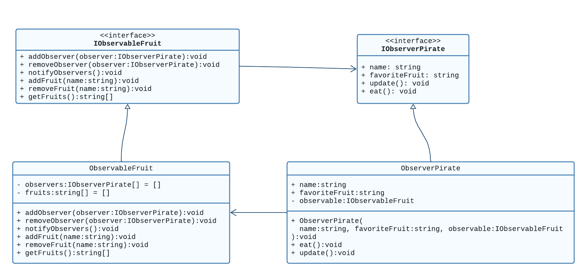

# Observer-FruitApp
Dieses Projekt implementiert das Observer Design pattern in TypeScript.  Es besteht aus zwei Hauptteilen: Observable und Observer.

Im Beispiel werden vier Piraten (Observers) erstellt, die jeweils eine Lieblingsfrucht haben. Sie werden alle zu einem `ObservableFruit` hinzugefügt. Dann werden drei Früchte zur Liste der Früchte hinzugefügt und alle Beobachter werden benachrichtigt. Jeder Pirat, dessen Lieblingsfrucht in der Liste ist, isst seine Frucht und entfernt sie aus der Liste.

## Installieren und Verwendung
Ich habe [bun.sh](https://bun.sh/) in diesem Projekt verwendet.

To install dependencies:

```bash
bun install
```

To run:

```bash
bun run index.ts
```

## Observable

Ein Observable ist ein Objekt, das Nachrichten sendet, die von den Observers empfangen werden. In diesem Projekt ist das Observable ein `ObservableFruit`, das eine Liste von Früchten verwaltet. Es hat die folgenden Methoden:

- `addObserver(observer: IObserverPirate)`: Fügt einen Observer zur Liste der Beobachter hinzu.
- `removeObserver(observer: IObserverPirate)`: Entfernt einen Observer aus der Liste der Beobachter.
- `notifyObservers()`: Benachrichtigt alle Beobachter, indem es ihre `update()`-Methode aufruft.
- `addFruit(name: string)`: Fügt eine Frucht zur Liste der Früchte hinzu.
- `removeFruit(name: string)`: Entfernt eine Frucht aus der Liste der Früchte.
- `getFruits()`: Gibt die Liste der Früchte zurück.

## Observer

Ein Observer ist ein Objekt, das auf Nachrichten von einem Observable reagiert. In diesem Projekt ist der Observer ein `ObserverPirate`, der eine Lieblingsfrucht hat und auf Änderungen in der Liste der Früchte reagiert. Es hat die folgenden Methoden:

- `update()`: Wird aufgerufen, wenn das Observable den Observer benachrichtigt. Wenn die Lieblingsfrucht des Piraten in der Liste der Früchte ist, ruft er die `eat()`-Methode auf.
- `eat()`: Entfernt die Lieblingsfrucht des Piraten aus der Liste der Früchte und gibt eine Nachricht aus.

## UML Diagram
